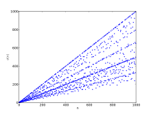

# RSA algorithm

> This lesson covers how RSA algorithm works.

## General overview

RSA is a two way encryption algorithm - it uses a pair of keys. A public key (which you can share with others) and a private key (which you should not share). Public key is used to encrypt a message which then becomes unreadable but it can be decrypted to its original form with private key.

## Math

Suppose we want to encrypt a given number m which is the message that we want to encrypt.

Suppose we choose two distinct large prime numbers p1 and p2 then divide them to get N. It will literally take years for modern computers to find what large primes you've chosen because the only method is guessing.

Now to get an encrypted message c we raise our m to the power of e and then apply mod N.

c = (m ^ e) mod N

e and N will be our public key that can be distributed to let people encrypt messages which only the private key owner can decrypt.

Now what is e? e must be:
* a coprime with N and φ(N).
* larger than 1 and smaller than φ(N)

Coprime means that GCD of two numbers is eqal 1.

φ(N) - this is [Euler's totient function](https://en.wikipedia.org/wiki/Euler%27s_totient_function) that returns how many integers are coprime with N.

We can observe that for any given prime Euler's totient function returns (prime-1).\
It has also another interesting property if gcd(a, b) = 1 then\
φ(a*b) = φ(a) * φ(b)\
Earlier we chose p1 and p2 which are two distinct prime numbers so their gcd will be 1.

That means:\
φ(N) = φ(p1) * φ(p2)\
φ(N) = (p1-1)*(p2-1)

Now that our next step is finding private key for decryption k.\
k * e mod φ(N) should be 1.

k is a modular multiplicative inverse of e.

If our encrypted message c will be raised to the power of k and then applied with mod N we will get our original message.

m = (c ^ k) mod N

This works because of all previous conditions were met so we can transform our equation:

m = (c ^ k) mod N\
c = (m ^ e) mod N

m = (m ^ (e*k)) mod N

...to eventually arrive at m = m.

## Final project

In this project we will use PyQt6 and rsa modules which can be installed with:

    pip install rsa PyQt6

rsa module documentation can be found [here](https://stuvel.eu/python-rsa-doc/usage.html).

Your goal is to create a desktop app that has a field which takes a message that be encrypted and decrypted with respective buttons (using rsa module, new keys will be generated every time the user launches the app). The encrypted and decrypted message should be shown in a separate label.